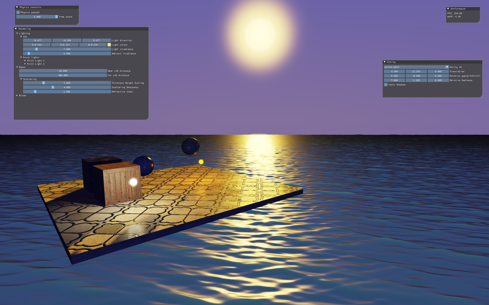

# Gradient

 
## Building
- Ensure that `vcpkg` is integrated with Visual Studio by running `vcpkg integrate install` from a Developer Command Prompt. 
- After that, simply build and run the solution.

## Controls
- Hold the left mouse button and move the mouse to move the camera.
- WASD to adjust the camera position. 
- C to descend, and Space to ascend. 

## Assets used
- Wooden crate materials: https://3dtextures.me/2021/02/12/wood-crate-001/  
- Floor tiles materials: https://juliovii.itch.io/tilespk02  
- Metal box, ball and ornament materials: https://juliovii.itch.io/metalpk01  
- Bark: https://www.fab.com/listings/5a0e1c65-f5b3-45c5-9d3e-9a1ff9abba4a
- Forest floor: https://www.fab.com/listings/db8c5bda-e867-412a-8e9a-f27c536d4ff8
- Birch leaf: https://www.fab.com/listings/8f51f1e3-921d-4a17-b9c9-123a494584bb
- Bark 2: https://www.fab.com/listings/c61dd941-4281-4772-bf2e-ecbfdbb6e676
Note that no assets are checked in.